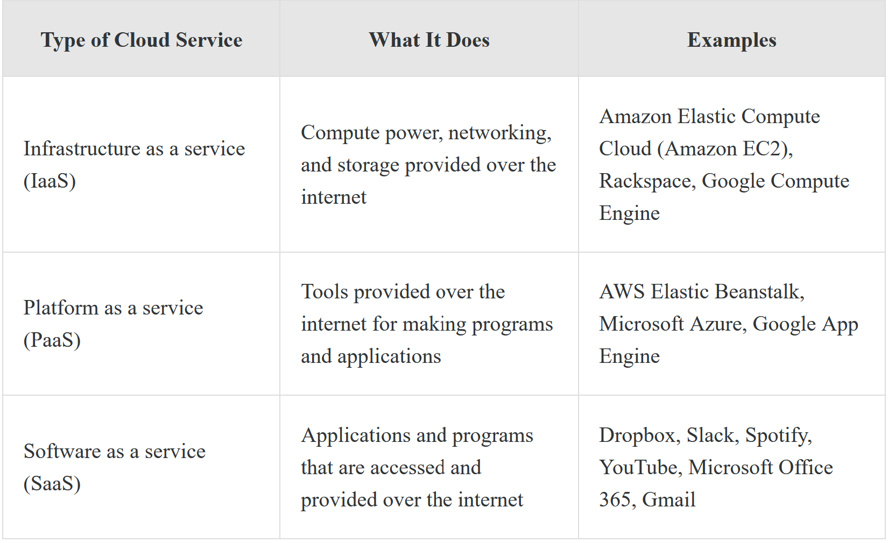
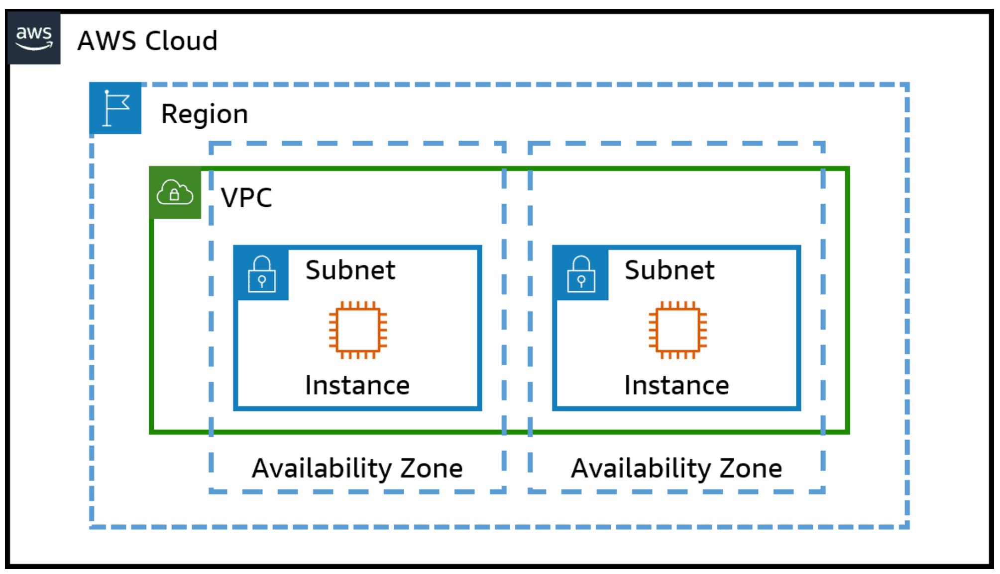
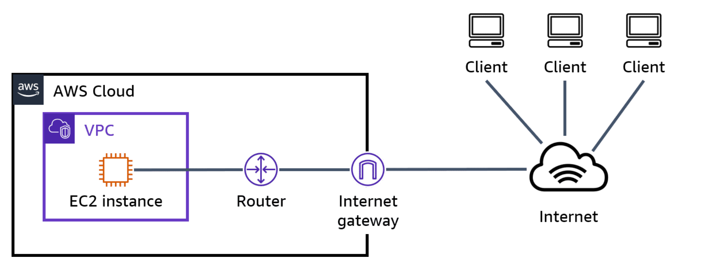

# AWS Introduction

## Cloud Computing
The on-demand delivery of compute power, databases, storage, applications, and other IT resources using the internet with pay-as-you-go pricing

## Amazon Web Services (AWS)
A platform that provides a wide range of cloud computing services.

## Cloud Storage
Saving data using a cloud service provider (CSP) instead of a physical machine.

## Cloud Computing
Whenever processing Data Online

## Reasons for Cloud Computing
- Pay less to get your business started. Pay more as your business grows.
- Services are cheaper because costs are spread across many users.
- Your computing power and storage scales to fit what you need, so you only pay for what you use.
- It is faster and easier to add new resources when you need them.
- Cloud providers maintain, secure, and run the computers and facilities for cloud services.
- It is easy to release your application or advertise anywhere in the word because everything is online.

## Types of Cloud Services

## Again, but different

### Software as a Service
A model that provides applications using the internet that are managed by a third party.

### Infrastructure as a Service
A model in which virtual machines and servers are used for customers to host a wide range of applications and IT services are provided.

### Platform as a Service
A model that provides a virtual platform for customers to create custom software.

## Availability Zone
One or more data centers that house many servers. Each Region has multiple, isolated locations known as Availability Zones. Each Availability Zone is isolated, but the Availability Zones in a Region are connected through low-latency links. An Availability Zone is represented by a region code followed by a letter identifier, for example, us-east-1a.

## Edge Location
A site where data can be stored for lower latency. Often, edge locations will be close to high-population areas that will generate high traffic volumes.

## Latency
The delay before a transfer of data begins after the data has been requested.

## Region
An area where data is stored. Data storage in a Region closest to you is one of the reasons it can be accessed at lightning speed.

## Amazon Services List
### Amazon Simple Storage Service (Amazon S3)
A service provided by AWS that stores data for users in the cloud.

### Amazon Elastic Compute Cloud (Amazon EC2)
A web service that provides secure, resizable compute capacity in the cloud. Think of it as renting a computer in the cloud.

### Amazon Elastic Book Store
Storage for specific EC2 instances. Storage Drive for your EC2 instance.

### Amazon Relational Database (Amazon RDS)
Relational Database Service & Management in the Cloud.

### Amazon Dynamo DB
NonRelational Database Service & Management Service

### AWS Lambda
Run Code without management or provision for Server (pay only when Code is running). Wide support for different application types.

### Amazon Virtual Private Cloud (Amazon VPC)
Virtual Network Service (only for AWS Account). Increased Protection and Management for Network.

### AWS Identity and Access Management (IAM)
User Management

### AWS CloudTrail
Monitoring of every Account-Action performed for Secutiry

### Amazon CloudWatch
Monitoring of AWS Resources and Applications on AWS

### Amazon Redshift
Data-Warehousing for massive amounts of data

### Amazon Route 53
AWS DNS web service

## AWS Cloud Structure

This diagram shows a VPC in one Region in the AWS Cloud. The VPC contains two subnets, and each subnet is in a different Availability Zone within the Region. Each subnet contains an EC2 instance.

## AWS Cloud Structure II

This diagram shows an EC2 instance within a VPC. The EC2 instance is connected to a router that is located outside the VPC but within AWS. The router is also connected to an internet gateway, which is located at the border of AWS and the internet. This internet gateway is connected to other computers that are located outside of the AWS environment.

