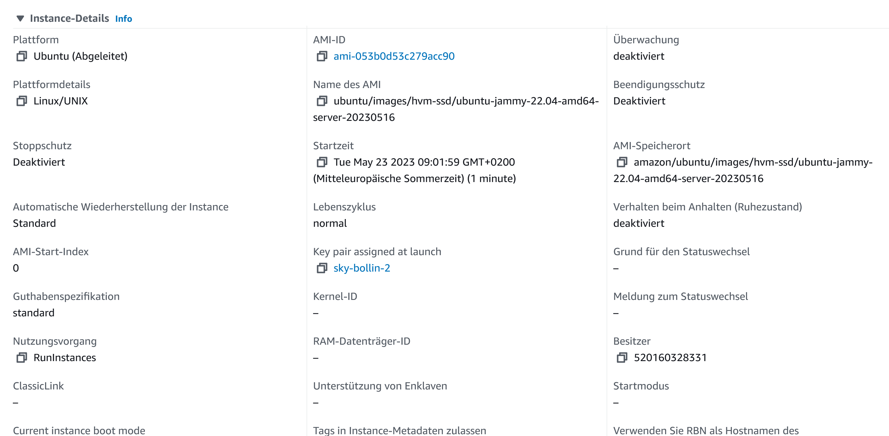
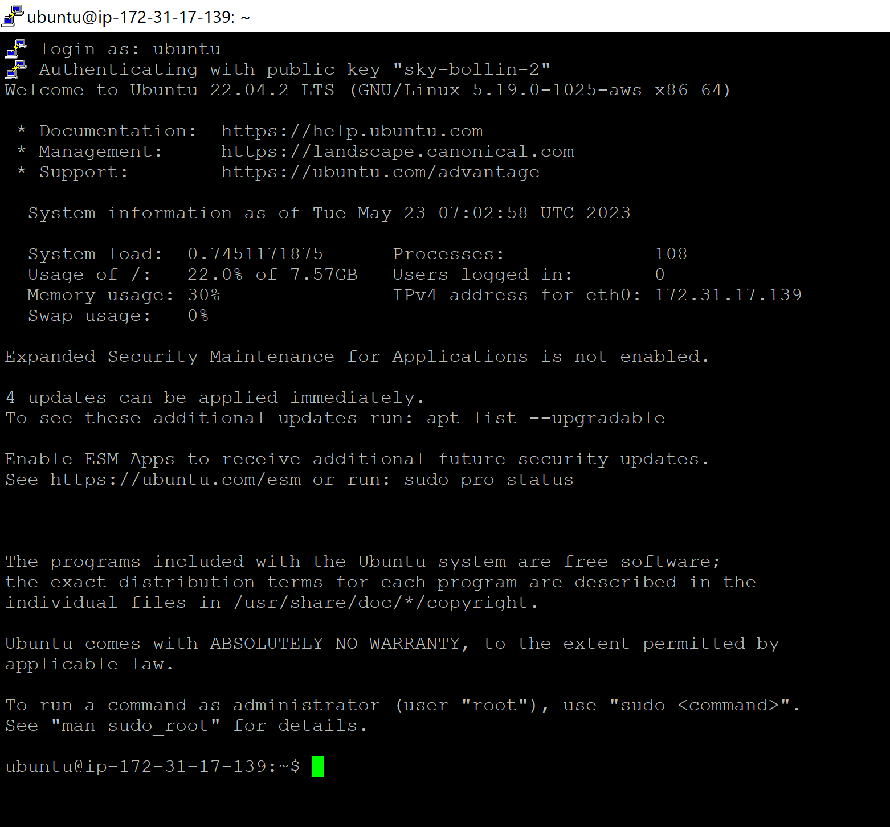
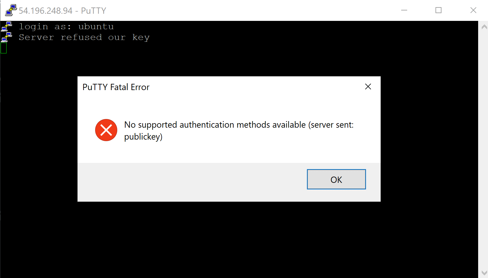

# A

## 4.1


Hier sieht man das Hello World, welches angezeigt wird, wenn man auf die Website zugreift.


Hier sieht man die EC2 liste mit der Public-IP Adresse, welche im Screenshot oben verwendet wird.

## 4.2


Liste der Buckets


Objekte im Bucket


Statische Website Hosting des Buckets


Zugriff auf die Website mit dem index.html

# B


Successfull ssh-key connection in PuTTY with public-key-1


Unsuccessfull ssh-key connection in PuTTY with public-key-2


Instanz-Detail mit private-key-1

# C

```yaml
#cloud-config
users: # alle User
  - name: ubuntu # default user's name
    sudo: ALL=(ALL) NOPASSWD:ALL # sudo regeln
    groups: users, admin # gruppen vom User
    home: /home/ubuntu # home-verzeichnis
    shell: /bin/bash # default shell verzeichnis
    ssh_authorized_keys: # liste erlaubte ssh-keys
      - ssh-rsa AAAAB3NzaC1yc2EAAAADAQABAAABAQCy4y5kYQTQCpZO3EUHGXvAqgyp3+Pau9s8u088xPUhPLjLccZUW8I52ss2NKaP67GjGoKu+XcYHGDrpKU2C4aBPNgf2+Cz8I8VhfPIcCNZWvUidmq0Z83/hrJT84dnPtQn0ZCpXLea5Qqgko9UdL5iULQ9kPdVBnTuf9BRYXcc2Kgh4CN0G5icQ+UY+AxuRN19rp5ZzwWCjO9JOJ4ReS0/FH0Bbevf5gSWf5WM8Oh0IJPAeLtttB2NlpfXEe6pPH3nh4LxNEamq6CL+sqWHEcMWUgJjmEV+egunxd9MvrYSaHbHr2N8+JS8wkxRe5SyN7weykaIfhpq6Qxjm941TUT aws-key # shh-key
ssh_pwauth: false # shh-password authentizierung
disable_root: false  # gibt es root-login
package_update: true # packete beim start updaten
packages: # liste von zu instalierenden paketen
  - curl # curl packet
  - wget # wget packet
```

# D


Instanz-Detail mit private-key-2


Successfull ssh-key connection in PuTTY with public-key-2


Unsuccessfull ssh-key connection in PuTTY with public-key-1
