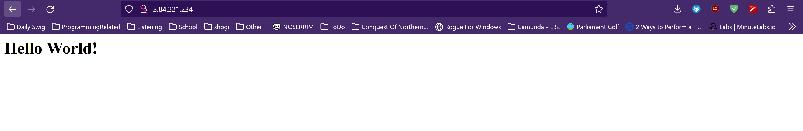
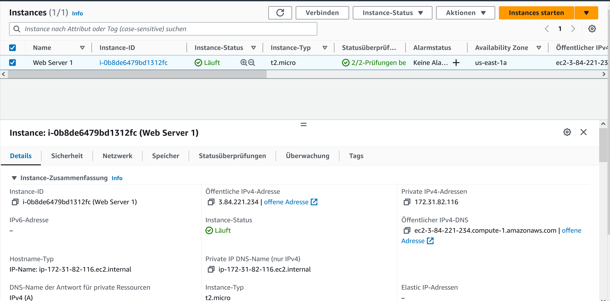
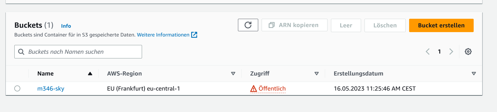
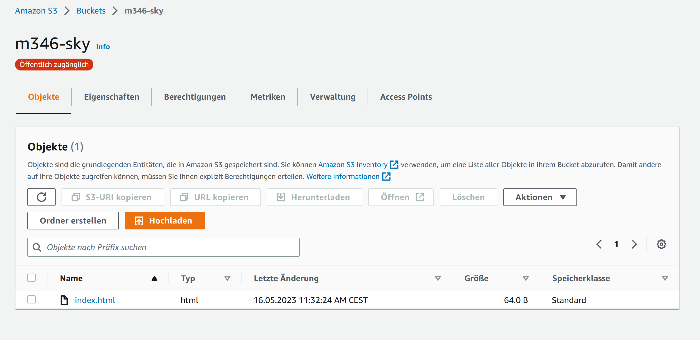
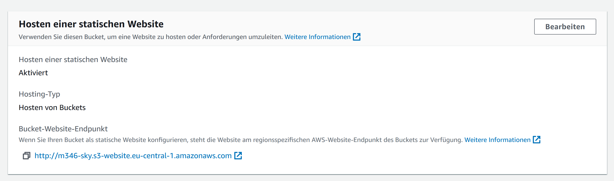
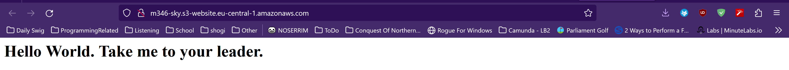
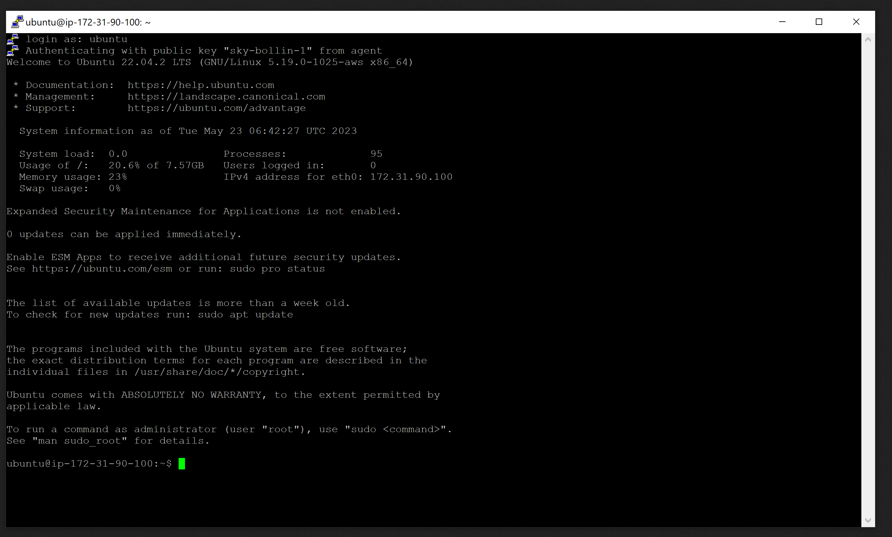
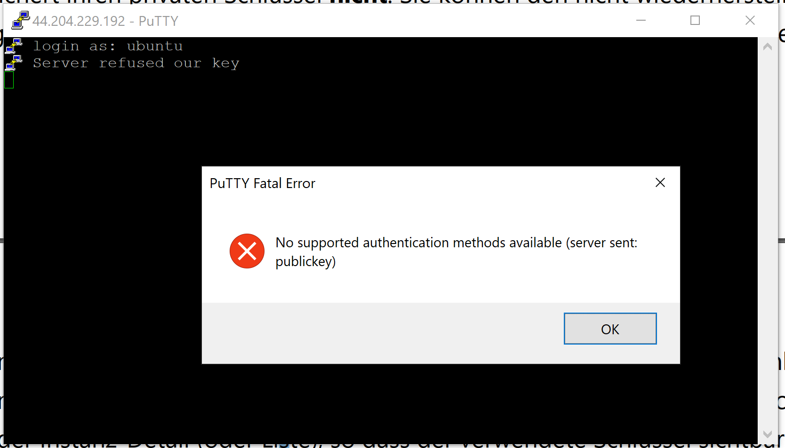
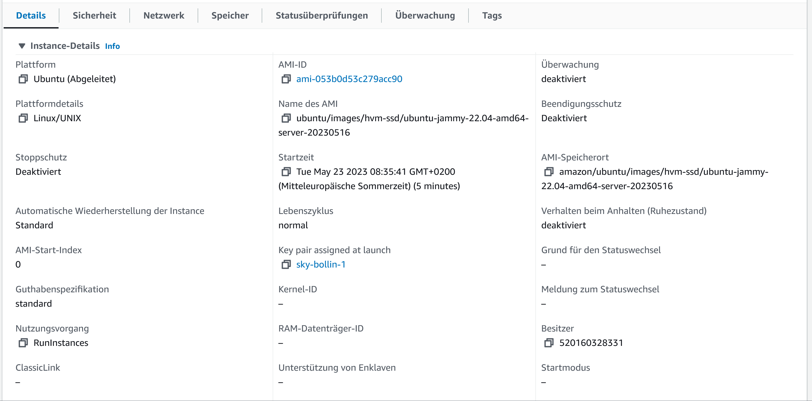

# A

## 4.1

Hier sieht man das Hello World, welches angezeigt wird, wenn man auf die Website zugreift.

Hier sieht man die EC2 liste mit der Public-IP Adresse, welche im Screenshot oben verwendet wird.

## 4.2

Liste der Buckets

Objekte im Bucket

Statische Website Hosting des Buckets

Zugriff auf die Website mit dem index.html

# B

Successfull ssh-key connection in PuTTY with public-key-1

Unsuccessfull ssh-key connection in PuTTY with public-key-2

Instanz-Detail mit private-key-1

# C
