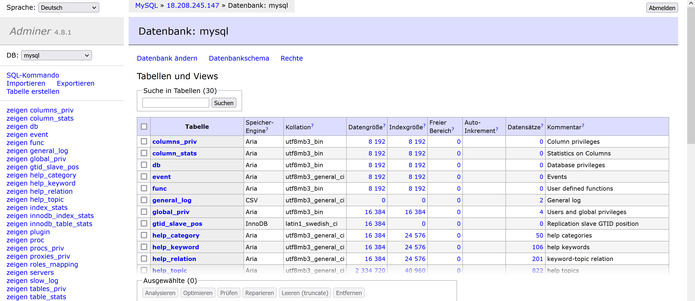

# A

## Yaml's

### cloud-init-db.yaml
```yaml
#cloud-config
users: # alle User
  - name: ubuntu # default user's name
    sudo: ALL=(ALL) NOPASSWD:ALL # sudo regeln
    groups: users, admin # gruppen vom User
    home: /home/ubuntu # home-verzeichnis
    shell: /bin/bash # default shell verzeichnis
    ssh_authorized_keys:
      - ssh-rsa AAAAB3NzaC1yc2EAAAADAQABAAABAQCy4y5kYQTQCpZO3EUHGXvAqgyp3+Pau9s8u088xPUhPLjLccZUW8I52ss2NKaP67GjGoKu+XcYHGDrpKU2C4aBPNgf2+Cz8I8VhfPIcCNZWvUidmq0Z83/hrJT84dnPtQn0ZCpXLea5Qqgko9UdL5iULQ9kPdVBnTuf9BRYXcc2Kgh4CN0G5icQ+UY+AxuRN19rp5ZzwWCjO9JOJ4ReS0/FH0Bbevf5gSWf5WM8Oh0IJPAeLtttB2NlpfXEe6pPH3nh4LxNEamq6CL+sqWHEcMWUgJjmEV+egunxd9MvrYSaHbHr2N8+JS8wkxRe5SyN7weykaIfhpq6Qxjm941TUT aws-key
ssh_pwauth: false
disable_root: false
package_update: true
packages:
  - mariadb-server
  - php-mysqli

runcmd:
 - sudo mysql -sfu root -e "GRANT ALL ON *.* TO 'admin'@'%' IDENTIFIED BY 'password' WITH GRANT OPTION;"
 - sudo sed -i 's/127.0.0.1/0.0.0.0/g' /etc/mysql/mariadb.conf.d/50-server.cnf
 - sudo systemctl restart mariadb.service
```

### cloud-init-web.yaml
```yaml
#cloud-config
users: # alle User
  - name: ubuntu # default user's name
    sudo: ALL=(ALL) NOPASSWD:ALL # sudo regeln
    groups: users, admin # gruppen vom User
    home: /home/ubuntu # home-verzeichnis
    shell: /bin/bash # default shell verzeichnis
    ssh_authorized_keys: # liste erlaubte ssh-keys
      - ssh-rsa AAAAB3NzaC1yc2EAAAADAQABAAABAQCy4y5kYQTQCpZO3EUHGXvAqgyp3+Pau9s8u088xPUhPLjLccZUW8I52ss2NKaP67GjGoKu+XcYHGDrpKU2C4aBPNgf2+Cz8I8VhfPIcCNZWvUidmq0Z83/hrJT84dnPtQn0ZCpXLea5Qqgko9UdL5iULQ9kPdVBnTuf9BRYXcc2Kgh4CN0G5icQ+UY+AxuRN19rp5ZzwWCjO9JOJ4ReS0/FH0Bbevf5gSWf5WM8Oh0IJPAeLtttB2NlpfXEe6pPH3nh4LxNEamq6CL+sqWHEcMWUgJjmEV+egunxd9MvrYSaHbHr2N8+JS8wkxRe5SyN7weykaIfhpq6Qxjm941TUT aws-key # shh-key
ssh_pwauth: false # shh-password authentizierung
disable_root: false  # gibt es root-login
package_update: true # packete beim start updaten
package_upgrade: true
packages: # liste von zu instalierenden paketen
  - apache2
  - php
  - libapache2-mod-php
  - php-mysqli
  - adminer

write_files:
 - encoding: b64 # db.php
   content: PD9waHAKICAgICAgICAvL2RhdGFiYXNlCiAgICAgICAgJHNlcnZlcm5hbWUgPSAiMTguMjA4LjI0NS4xNDciOwogICAgICAgICR1c2VybmFtZSA9ICJhZG1pbiI7CiAgICAgICAgJHBhc3N3b3JkID0gInBhc3N3b3JkIjsKICAgICAgICAkZGJuYW1lID0gIm15c3FsIjsKCiAgICAgICAgLy8gQ3JlYXRlIGNvbm5lY3Rpb24KICAgICAgICAkY29ubiA9IG5ldyBteXNxbGkoJHNlcnZlcm5hbWUsICR1c2VybmFtZSwgJHBhc3N3b3JkLCAkZGJuYW1lKTsKICAgICAgICAvLyBDaGVjayBjb25uZWN0aW9uCiAgICAgICAgaWYgKCRjb25uLT5jb25uZWN0X2Vycm9yKSB7CiAgICAgICAgICAgICAgICBkaWUoIkNvbm5lY3Rpb24gZmFpbGVkOiAiIC4gJGNvbm4tPmNvbm5lY3RfZXJyb3IpOwogICAgICAgIH0KCiAgICAgICAgJHNxbCA9ICJzZWxlY3QgSG9zdCwgVXNlciBmcm9tIG15c3FsLnVzZXI7IjsKICAgICAgICAkcmVzdWx0ID0gJGNvbm4tPnF1ZXJ5KCRzcWwpOwogICAgICAgIHdoaWxlKCRyb3cgPSAkcmVzdWx0LT5mZXRjaF9hc3NvYygpKXsKICAgICAgICAgICAgICAgIGVjaG8oJHJvd1siSG9zdCJdIC4gIiAvICIgLiAkcm93WyJVc2VyIl0gLiAiPGJyIC8+Iik7CiAgICAgICAgfQogICAgICAgIC8vdmFyX2R1bXAoJHJlc3VsdCk7Cj8+Cg==
   path: /var/www/html/db.php

 - encoding: b64 # info.php
   content: PD9waHAKICAgICAgICAvLyBTaG93IGFsbCBpbmZvcm1hdGlvbiwgZGVmYXVsdHMgdG8gSU5GT19BTEwKICAgICAgICBwaHBpbmZvKCk7CiAgICA/Pg==
   path: /var/www/html/info.php

runcmd:
 - sudo a2enconf adminer
 - sudo systemctl restart apache2
```
## Screenshots

### db


"mysql -u admin -p" im Terminal


Lokale Verbindung mit dBeaver

### web-server


db.php


info.php


index.html


adminer



successfull connection with adminer

# B

## a

Hot Storage:
Daten werden in SSD's abgespeichert um schnell zugreifbar zu sein.

## b


Instanz mit 2 Volume


Warnung:
Nur EBS Volumes mit "Delete on Termination" werden gelöscht. Unsere EBS Volume werden persistiert.


Nach dem Löschen: Daten im Volume werden Persistiert.
