# Screenshots

## NamensListe (Bitte ignorieren)
liste aller namen

sn-KN04-sky-v1
KN04-web-1

KN04-web-security
KN04-db-security

KN04-web-elastic-sky
KN04-db-elastic-sky

KN04-web-ni-sky
KN04-db-ni-sky

## Subnet

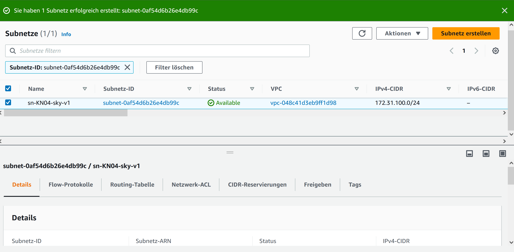

Neues Subnetz erstellt

## Sicherheitsgruppen

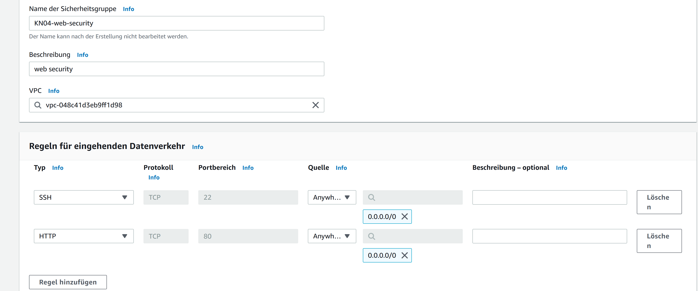

Sicherheitsgruppe WEB

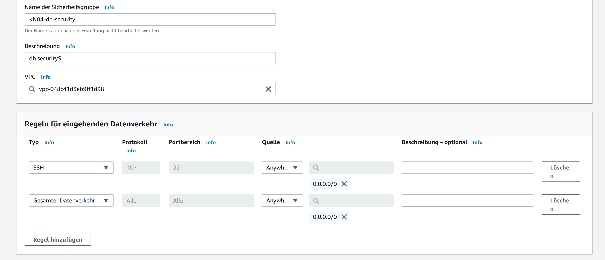

Sicherheitsgruppe DB

## Elastic IPs

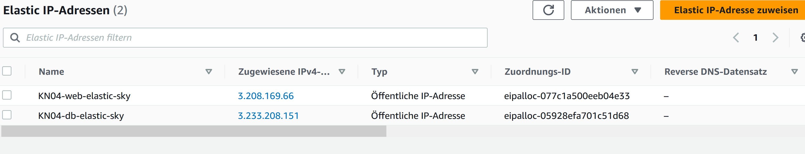
beide elastic IPs

## Netzwerk Interface

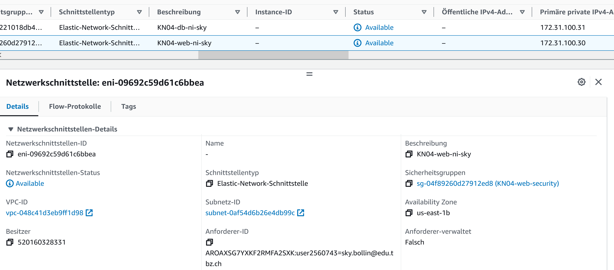
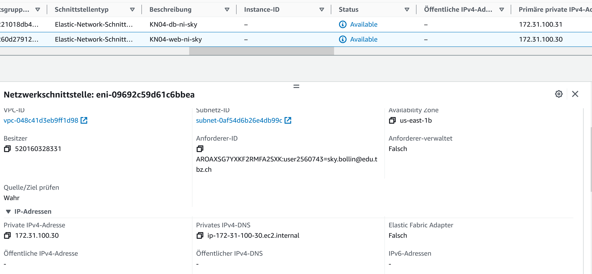
web-server

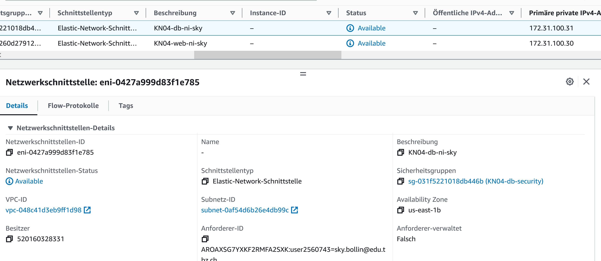
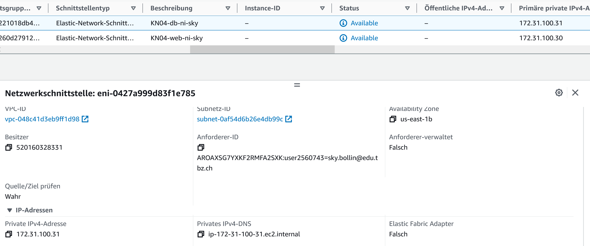
db

## Neue yaml's

### cloud-init-db.yaml
```yaml
#cloud-config
users: # alle User
  - name: ubuntu # default user's name
    sudo: ALL=(ALL) NOPASSWD:ALL # sudo regeln
    groups: users, admin # gruppen vom User
    home: /home/ubuntu # home-verzeichnis
    shell: /bin/bash # default shell verzeichnis
    ssh_authorized_keys:
      - ssh-rsa AAAAB3NzaC1yc2EAAAADAQABAAABAQCy4y5kYQTQCpZO3EUHGXvAqgyp3+Pau9s8u088xPUhPLjLccZUW8I52ss2NKaP67GjGoKu+XcYHGDrpKU2C4aBPNgf2+Cz8I8VhfPIcCNZWvUidmq0Z83/hrJT84dnPtQn0ZCpXLea5Qqgko9UdL5iULQ9kPdVBnTuf9BRYXcc2Kgh4CN0G5icQ+UY+AxuRN19rp5ZzwWCjO9JOJ4ReS0/FH0Bbevf5gSWf5WM8Oh0IJPAeLtttB2NlpfXEe6pPH3nh4LxNEamq6CL+sqWHEcMWUgJjmEV+egunxd9MvrYSaHbHr2N8+JS8wkxRe5SyN7weykaIfhpq6Qxjm941TUT aws-key
ssh_pwauth: false
disable_root: false
package_update: true
packages:
  - mariadb-server
  - php-mysqli

runcmd:
 - sudo mysql -sfu root -e "GRANT ALL ON *.* TO 'admin'@'%' IDENTIFIED BY 'password' WITH GRANT OPTION;"
 - sudo sed -i 's/127.0.0.1/0.0.0.0/g' /etc/mysql/mariadb.conf.d/50-server.cnf
 - sudo systemctl restart mariadb.service
```

### cloud-init-web.yaml
```yaml
#cloud-config
users: # alle User
  - name: ubuntu # default user's name
    sudo: ALL=(ALL) NOPASSWD:ALL # sudo regeln
    groups: users, admin # gruppen vom User
    home: /home/ubuntu # home-verzeichnis
    shell: /bin/bash # default shell verzeichnis
    ssh_authorized_keys: # liste erlaubte ssh-keys
      - ssh-rsa AAAAB3NzaC1yc2EAAAADAQABAAABAQCy4y5kYQTQCpZO3EUHGXvAqgyp3+Pau9s8u088xPUhPLjLccZUW8I52ss2NKaP67GjGoKu+XcYHGDrpKU2C4aBPNgf2+Cz8I8VhfPIcCNZWvUidmq0Z83/hrJT84dnPtQn0ZCpXLea5Qqgko9UdL5iULQ9kPdVBnTuf9BRYXcc2Kgh4CN0G5icQ+UY+AxuRN19rp5ZzwWCjO9JOJ4ReS0/FH0Bbevf5gSWf5WM8Oh0IJPAeLtttB2NlpfXEe6pPH3nh4LxNEamq6CL+sqWHEcMWUgJjmEV+egunxd9MvrYSaHbHr2N8+JS8wkxRe5SyN7weykaIfhpq6Qxjm941TUT aws-key # shh-key
ssh_pwauth: false # shh-password authentizierung
disable_root: false  # gibt es root-login
package_update: true # packete beim start updaten
package_upgrade: true
packages: # liste von zu instalierenden paketen
  - apache2
  - php
  - libapache2-mod-php
  - php-mysqli
  - adminer

write_files:
 - encoding: b64 # db.php
   content: PD9waHAKICAgICAgICAvL2RhdGFiYXNlCiAgICAgICAgJHNlcnZlcm5hbWUgPSAiMTcyLjMxLjEwMC4zMSI7CiAgICAgICAgJHVzZXJuYW1lID0gImFkbWluIjsKICAgICAgICAkcGFzc3dvcmQgPSAicGFzc3dvcmQiOwogICAgICAgICRkYm5hbWUgPSAibXlzcWwiOwoKICAgICAgICAvLyBDcmVhdGUgY29ubmVjdGlvbgogICAgICAgICRjb25uID0gbmV3IG15c3FsaSgkc2VydmVybmFtZSwgJHVzZXJuYW1lLCAkcGFzc3dvcmQsICRkYm5hbWUpOwogICAgICAgIC8vIENoZWNrIGNvbm5lY3Rpb24KICAgICAgICBpZiAoJGNvbm4tPmNvbm5lY3RfZXJyb3IpIHsKICAgICAgICAgICAgICAgIGRpZSgiQ29ubmVjdGlvbiBmYWlsZWQ6ICIgLiAkY29ubi0+Y29ubmVjdF9lcnJvcik7CiAgICAgICAgfQoKICAgICAgICAkc3FsID0gInNlbGVjdCBIb3N0LCBVc2VyIGZyb20gbXlzcWwudXNlcjsiOwogICAgICAgICRyZXN1bHQgPSAkY29ubi0+cXVlcnkoJHNxbCk7CiAgICAgICAgd2hpbGUoJHJvdyA9ICRyZXN1bHQtPmZldGNoX2Fzc29jKCkpewogICAgICAgICAgICAgICAgZWNobygkcm93WyJIb3N0Il0gLiAiIC8gIiAuICRyb3dbIlVzZXIiXSAuICI8YnIgLz4iKTsKICAgICAgICB9CiAgICAgICAgLy92YXJfZHVtcCgkcmVzdWx0KTsKPz4K
   path: /var/www/html/db.php

 - encoding: b64 # info.php
   content: PD9waHAKICAgICAgICAvLyBTaG93IGFsbCBpbmZvcm1hdGlvbiwgZGVmYXVsdHMgdG8gSU5GT19BTEwKICAgICAgICBwaHBpbmZvKCk7CiAgICA/Pg==
   path: /var/www/html/info.php

runcmd:
 - sudo a2enconf adminer
 - sudo systemctl restart apache2
```

## Elastische IP zuweisung

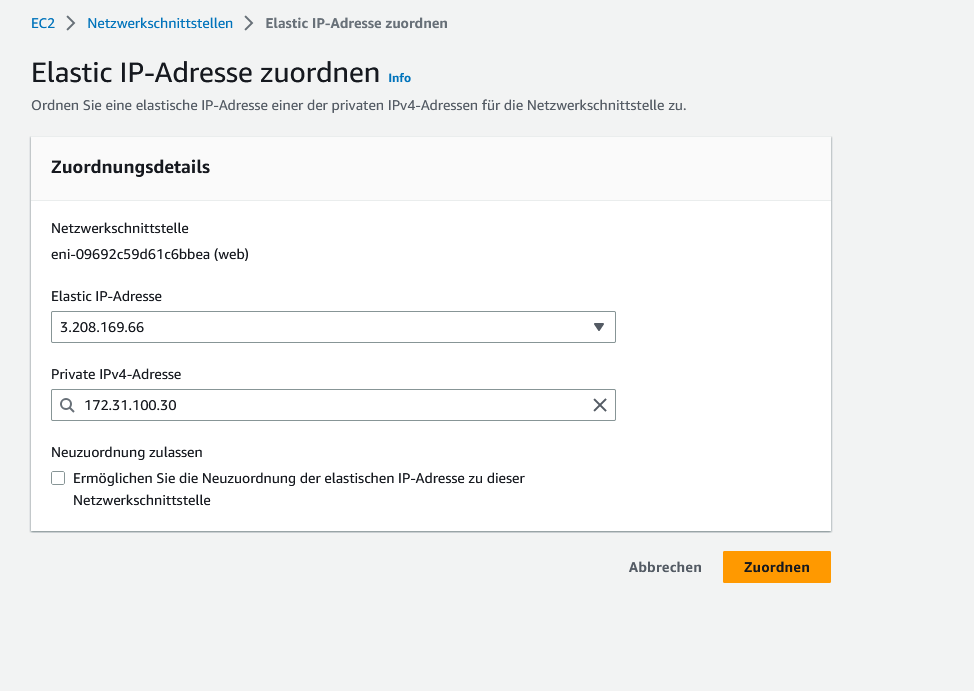

Elastische IP zugewiesen

## Seiten aufrufen

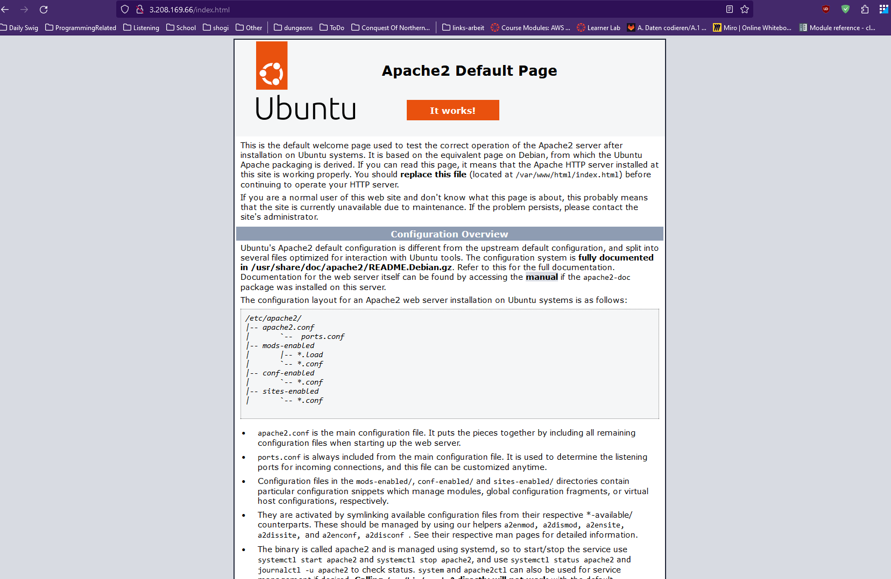
index.html

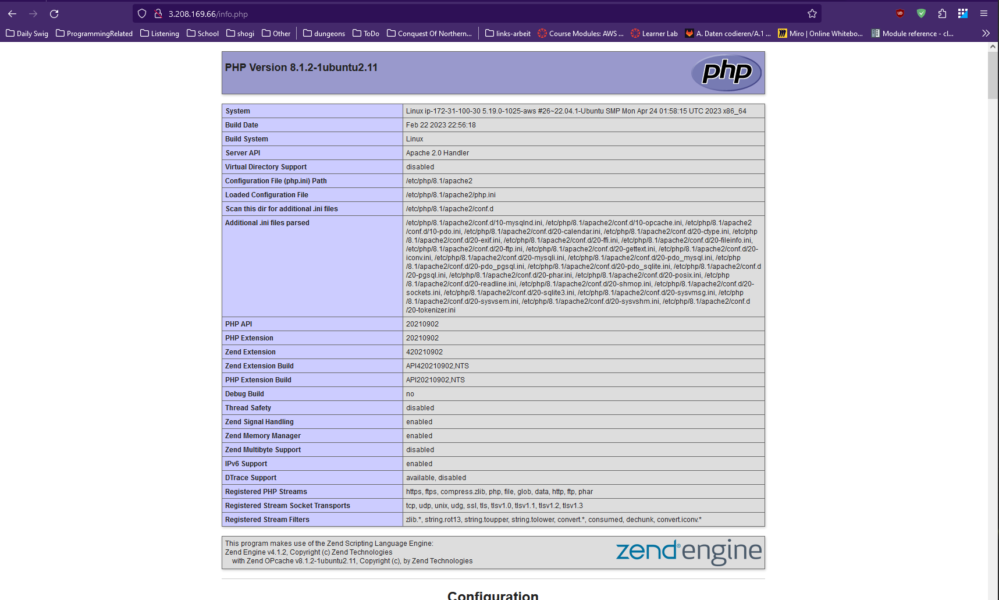
info.php

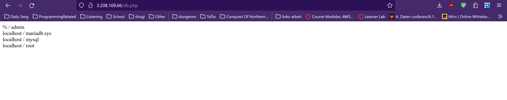
db.php