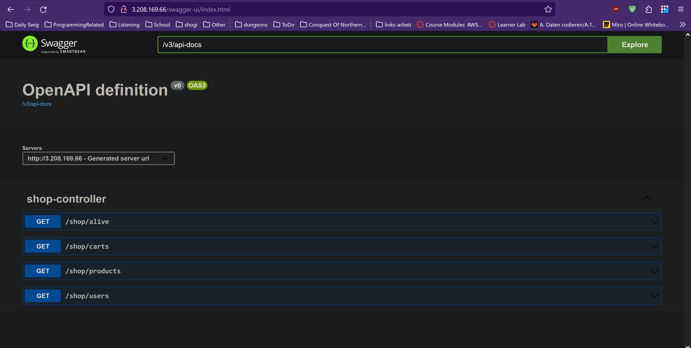
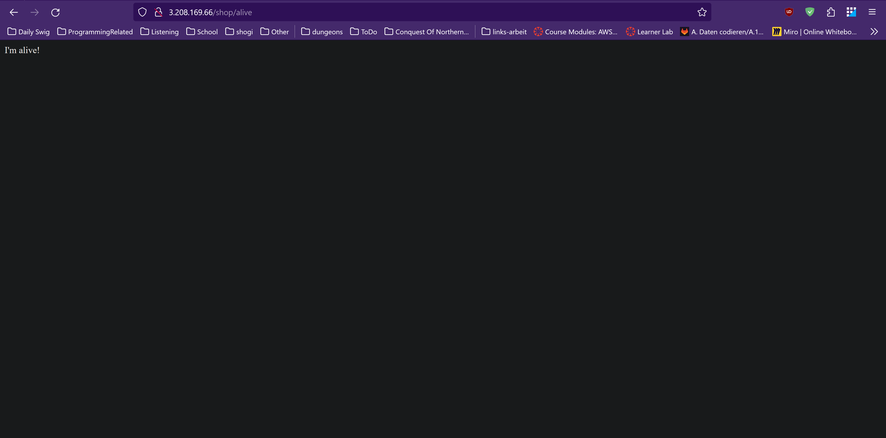
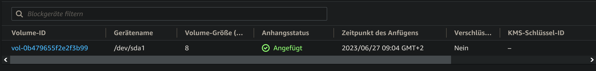
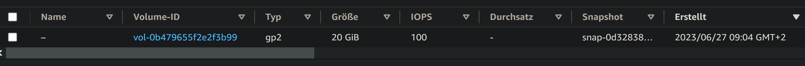
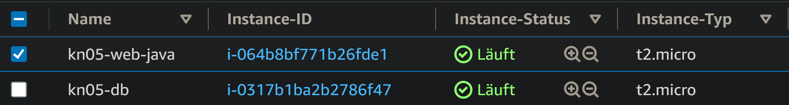
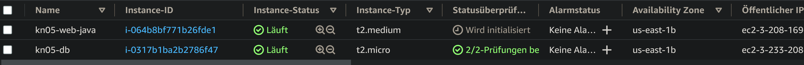

# Start yaml's

## Web Server (Java)
```yaml
#cloud-config
users:
  - name: ubuntu
    sudo: ALL=(ALL) NOPASSWD:ALL
    groups: users, admin
    home: /home/ubuntu
    shell: /bin/bash
    ssh_authorized_keys:
      - ssh-rsa AAAAB3NzaC1yc2EAAAADAQABAAABAQCy4y5kYQTQCpZO3EUHGXvAqgyp3+Pau9s8u088xPUhPLjLccZUW8I52ss2NKaP67GjGoKu+XcYHGDrpKU2C4aBPNgf2+Cz8I8VhfPIcCNZWvUidmq0Z83/hrJT84dnPtQn0ZCpXLea5Qqgko9UdL5iULQ9kPdVBnTuf9BRYXcc2Kgh4CN0G5icQ+UY+AxuRN19rp5ZzwWCjO9JOJ4ReS0/FH0Bbevf5gSWf5WM8Oh0IJPAeLtttB2NlpfXEe6pPH3nh4LxNEamq6CL+sqWHEcMWUgJjmEV+egunxd9MvrYSaHbHr2N8+JS8wkxRe5SyN7weykaIfhpq6Qxjm941TUT aws-key
ssh_pwauth: true
disable_root: false  
package_update: true 
packages:
  - curl
  - wget
  - nginx
  - openjdk-18-jre
write_files:
  - content: |
      [Unit]
      Description=Demo Shop
      After=syslog.target
      [Service]
      WorkingDirectory=/var/www/app
      User=www-data
      ExecStart=java -jar /var/www/app/shopdemo-1.0.0.jar --spring.config.additional-location=production.properties SuccessExitStatus=143 
      Restart=always
      RestartSec=10
      [Install] 
      WantedBy=multi-user.target
    path: /etc/systemd/system/shop-app.service
  - content: |
      server {
        listen        80;
        server_name   3.208.169.66;
        location / {
          proxy_pass         http://127.0.0.1:5001;
          proxy_http_version 1.1;
          proxy_set_header   Upgrade $http_upgrade;
          proxy_set_header   Connection keep-alive;
          proxy_set_header   Host $host;
          proxy_cache_bypass $http_upgrade;
          proxy_set_header   X-Forwarded-For $proxy_add_x_forwarded_for;
          proxy_set_header   X-Forwarded-Proto $scheme;
        }
      }
    path: /home/ubuntu/nginx
runcmd:
  - sudo mkdir /var/www
  - sudo mkdir /var/www/app
  - sudo git clone https://gitlab.com/ch-tbz-it/Stud/m346/m346scripts.git
  - sudo sed -i 's/<your-connection-string>/jdbc:mysql:\/\/3.233.208.151:3306\/shop/g' ./m346scripts/KN05/java/production.properties
  - sudo cp -r ./m346scripts/KN05/java/* /var/www/app/
  - sudo systemctl enable shop-app.service
  - sudo systemctl start shop-app.service
  - sudo service nginx start
  - sudo cp /home/ubuntu/nginx /etc/nginx/sites-available/default
  - sudo nginx -s reload
```

## DB Server
```yaml
#cloud-config
users:
  - name: ubuntu
    sudo: ALL=(ALL) NOPASSWD:ALL
    groups: users, admin
    home: /home/ubuntu
    shell: /bin/bash
    ssh_authorized_keys:
      - ssh-rsa AAAAB3NzaC1yc2EAAAADAQABAAABAQCy4y5kYQTQCpZO3EUHGXvAqgyp3+Pau9s8u088xPUhPLjLccZUW8I52ss2NKaP67GjGoKu+XcYHGDrpKU2C4aBPNgf2+Cz8I8VhfPIcCNZWvUidmq0Z83/hrJT84dnPtQn0ZCpXLea5Qqgko9UdL5iULQ9kPdVBnTuf9BRYXcc2Kgh4CN0G5icQ+UY+AxuRN19rp5ZzwWCjO9JOJ4ReS0/FH0Bbevf5gSWf5WM8Oh0IJPAeLtttB2NlpfXEe6pPH3nh4LxNEamq6CL+sqWHEcMWUgJjmEV+egunxd9MvrYSaHbHr2N8+JS8wkxRe5SyN7weykaIfhpq6Qxjm941TUT aws-key
ssh_pwauth: true
disable_root: false 
package_update: true  
packages:
  - mariadb-server
runcmd:
  - sudo mysql -sfu root -e "GRANT ALL ON *.* TO 'admin'@'%' IDENTIFIED BY 'password' WITH GRANT OPTION;"
  - sudo sed -i 's/127.0.0.1/0.0.0.0/g' /etc/mysql/mariadb.conf.d/50-server.cnf
  - sudo systemctl restart mariadb.service
  - sudo cd /home/ubuntu
  - sudo git clone https://gitlab.com/ch-tbz-it/Stud/m346/m346scripts.git
  - sudo mysql -sfu root < ./m346scripts/KN05/shop-database.sql

```

# Screenshots

## A
Swagger UI


Web Access auf einen Endpoint (Mit Swagger FortiGuard Intrusion Block)


## B
### DB
Vorher

Nachher


## Web
Vorher

Nachher



